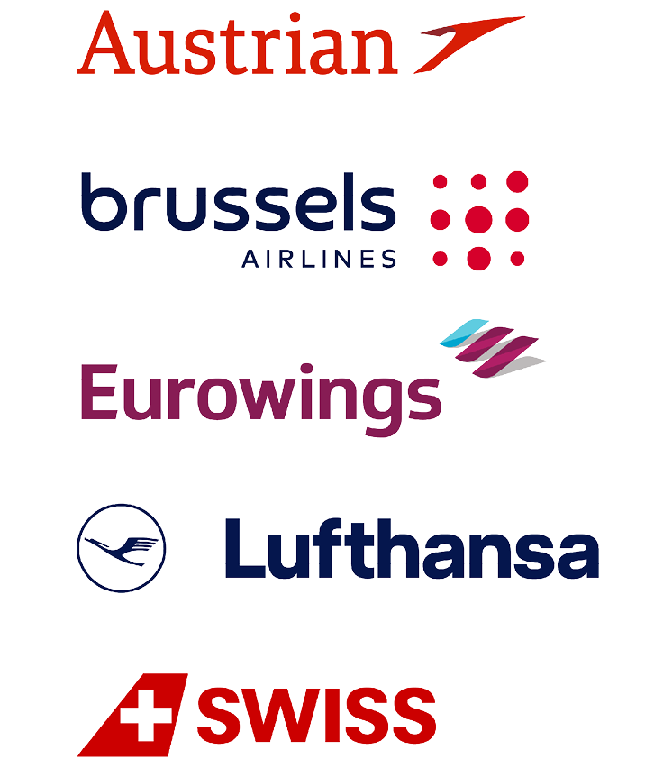

For information about the city of Maastricht, the venue and hotels, visit [this page](../maastricht)

## Arriving in Maastricht by plane

For optimal connectivity and convenience, we recommend the following airports, all within three hours of Maastricht by public transport (see train information below):

- **Brussels Zaventem Airport**
- **Düsseldorf Airport**
- **Eindhoven Airport**

Several other airports also offer efficient train connections to Maastricht:

- Amsterdam Schiphol Airport
- Brussels Charleroi Airport
- Cologne-Bonn Airport
- Paris Charles de Gaulle Airport

### Special fares with the Lufthansa Group airlines

The Lufthansa Group airlines bring people together - every day, all around the world. The global route network of Austrian Airlines, Lufthansa, SWISS, Brussels Airlines and Eurowings offers optimal connection and combination options, so you will benefit from quick and direct flights to the event.

You will reach the booking platform via this [link](https://www.lufthansa.com/event/netsci-2025-jun). The reduced fares are automatically displayed.

**NB: Please enable pop-ups permanently in your browser while booking, otherwise the window in the booking platform will not open.**

{:width="250px"} 

### Shuttle Service from the Airport

We offer a shuttle service from and to **Brussels Zaventem Airport** and **Düsseldorf International Airport** to the doorstep of your hotel.

Depending on the average number of arrivals, taxis, minivans and coaches are available for shuttle service.

For more information and to make a reservation, please click on the link below.

[**Book your shuttle here**](https://gotomaastricht.eu/netsci2025/)

---

## Arriving in Maastricht by train

**"Maastricht-Central"** and **"Maastricht-Randwyck"** station are part of the national and international railway network. There are frequent trains to Maastricht Central Station, which is also connected to the national and international rail network. For an overview or to book these trains, please visit the website of [NS International](https://www.nsinternational.nl).

### Travel information:

- From **Brussels Airport (Zaventem)**: The journey takes 1.5 to 3 hours, depending on the route and transfers. The airport train station is located under the terminal (basement level 1) near the arrival and departure halls. 
- From **Düsseldorf Hbf**: The train takes approximately 2 hours 30 minutes.
- From **Eindhoven Airport**: The journey takes approximately 2 hours, depending on the route and transfers. You will need to take a bus to the Eindhoven train station.
- From **Schiphol Airport (Amsterdam)**: Direct trains to Maastricht take approximately 2.5 hours. The Schiphol train station is conveniently located just below the airport.

---

<!--
## Registration information
...

## How to make it to Maastricht

Info on the airports

### Shuttle services

To complete the accessibility from the airport terminal to the doorstep of your hotel, we will provide shuttle services from and to Brussels Zaventem Airport and Düsseldorf International Airport.

Depending on the average arrivals of the delegates, taxi’s, mini-vans and coaches are available to use as a shuttle.
 
For more information and making a reservation, please click the button below.

(BUTTON) Book your shuttle”

 
### Reduced fares with Lufthansa

 
The Lufthansa Group airlines bring people together - every day, all around the world. The global route network of Austrian Airlines, Lufthansa, SWISS, Brussels Airlines and Eurowings offers optimal connection and combination options, so you will benefit from quick and direct flights to the event.

You will reach the booking platform via the button below and with the event code NLAPITX. The reduced fares are automatically displayed.

 

NB: Please enable pop-ups permanently in your browser while booking, otherwise the window in the booking platform will not open.

 

For more information and making a reservation, please click the button below.

 

(BUTTON)Book your flight here” -->

